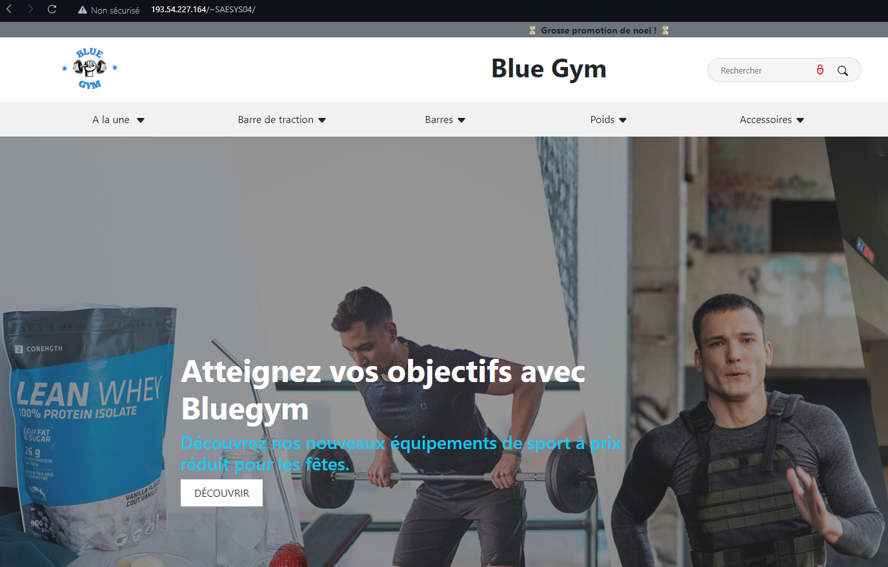
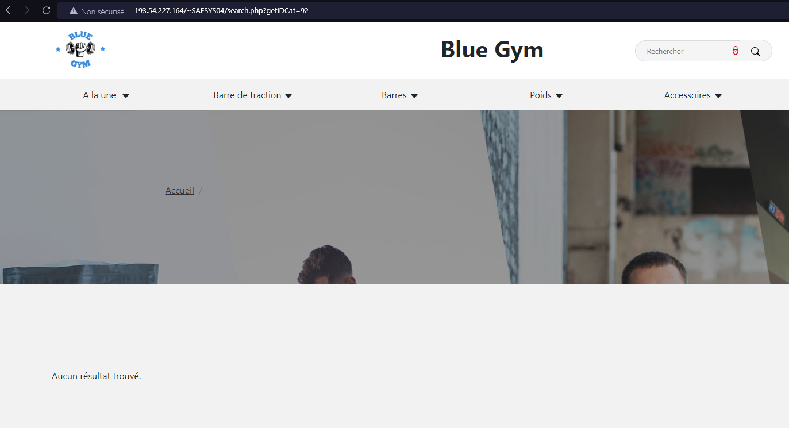

= SAÉ 3.01 2022-2023 : Documentation Test 1 : Accès au site et Navigation
:incremental:
:numbered:
:TOC:
:TOC-title: Sommaire

== Présentation du projet

=== Equipe

Ce Projet à été est réalisé par::

- https://github.com/Munozmu[Gabin Munoz] 
- https://github.com/AurelienSP[Aurelien Sanchez-Porro]
- https://github.com/Hugo-Vacquier[Hugo Vacquier]
- https://github.com/andrew-phakeovilay[Andrew Phakeovilay]
- https://github.com/quentin-beaufort[Quentin Beaufort]

Tuteur/tutrice enseignant(e) de l'équipe:: mailto:jean-michel.bruel@univ-tlse2.fr[JMB]

=== Contexte

BlueGym nous à contacté afin de créer un site d'e-commerce. +
Ce site doit être accèssible par un utilisateur, et celui ci doit pouvoir naviguer dans le site librement.

== Tests

=== Accès au site

L'utilisateur doit avoir accès au site avec l'adresse ip http://192.168.224.139/~SAESYS04 si il est connecté en filaire à l'iut.

.Connexion au site depuis l'IUT

Sinon, il doit pouvoir accéder au site en utilisant l'adresse http://193.54.227.164/~SAESYS04.

.Connexion au site hors de l'IUT 

Si il ne mets pas le bon lien, alors il ne pourra pas rejoindre le site.

.Utilisation d'une mauvaise adresse IP (193.54.228.164)
image::https://github.com/IUT-Blagnac/sae3-01-devapp-g1b-4/blob/master/Documentation/e-commerce/Tests/images/tst_1_03.png[test incorrect]

=== Navigation

Depuis la page d'accueil, l'utilisateur peut consulter plusieurs catégories d'article. +
Pour cela, il a la possibilité de cliquer sur une des listes déroulantes se trouvant au sommet de la page. +
Il aura ainsi accès aux produits de cette catégorie.

.Liste déroulante quand "Barre de traction" est cliqué
image::https://github.com/IUT-Blagnac/sae3-01-devapp-g1b-4/blob/master/Documentation/e-commerce/images/DU_CAT_BARRE.png[liste déroulante d'une catégorie]

.Produits de la catégorie "Barre de traction porte"
image::https://github.com/IUT-Blagnac/sae3-01-devapp-g1b-4/blob/master/Documentation/e-commerce/images/DU_EXEMP_BARRE.png[Produits de la catégorie]

L'utilisateur peut modifier la catégorie dans l'url. +
S'il indique le numéro d'une catégorie inexistante, alors la page indiquera qu'aucun produit n'a été trouvé.

.Produits se trouvant dans la catégorie n°92 (n'existe pas)

=== Recherche

L'utilisateur peut chercher un produit grâce à la barre de recherche. Pour cela, il suffit de la remplir avec un terme cohérent, et de cliquer sur l'icône de loupe.

.Résultat de la recherche avec le mot "Traction"
image::https://github.com/IUT-Blagnac/sae3-01-devapp-g1b-4/blob/master/Documentation/e-commerce/Tests/images/tst_1_06.png[Résultat pour "traction"]

Si l'utilisateur clique sur la loupe à coté de la barre de recherche sans la remplir, alors il pourra naviguer à travers tous les produits du site.

.Tous les produits, après n'avoir fait aucune recherche
image::https://github.com/IUT-Blagnac/sae3-01-devapp-g1b-4/blob/master/Documentation/e-commerce/Tests/images/tst_1_05.png[Aucune recherche]

Cependant, si l'utilisateur recherche une expression qui n'apparait pas dans le site ou est incoherent, alors aucun article ne sera présenté.

.Résultat de la recherche pour un produit inexistant
image::https://github.com/IUT-Blagnac/sae3-01-devapp-g1b-4/blob/master/Documentation/e-commerce/Tests/images/tst_1_07.png[Il n'y a pas de PS5 dans un magasin de sport]

=== Produit

L'utilisateur doit pouvoir accéder à la page d'informations d'un produit :

* En cliquant sur sa fiche dans la page de recherche

* En renseignant le numéro du produit dans l'url

.Page du produit n°1
image::https://github.com/IUT-Blagnac/sae3-01-devapp-g1b-4/blob/master/Documentation/e-commerce/Tests/images/tst_1_08.png[Page pour une barre]

Dans le cas où il renseigne un numéro de produit inexistant, alors l'utilisateur sera renvoyé sur la page d'accueil.

.Renvoi sur la page d'accueil après avoir voulu accéder au produit n°70
image::https://github.com/IUT-Blagnac/sae3-01-devapp-g1b-4/blob/master/Documentation/e-commerce/Tests/images/tst_1_09.png[Pas de produit numero 70]